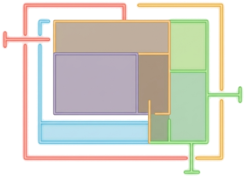

<p align="center"></p>

# SubnetCraft — Plan, split and document IP networks

**English** · [Español](README.es.md)

A browser-based suite for planning and calculating IP networks. It works for beginners (guided flows, plain-language explanations) and for experienced engineers (fast inputs, exports, keyboard shortcuts, device configuration).

Everything runs in your browser. There is no backend, no build step, and no dependencies to install.

## Tools

| # | Tab | What it does |
|---|-----|--------------|
| 01 | **Visual splitter** | Split a network into subnets by clicking, as an interactive tree table. |
| 02 | **VLSM planner** | Tell it how many hosts each network needs and it sizes and places every subnet. |
| 03 | **IPv4 calculator** | Network, broadcast, masks, host range, binary view, and a plain-language summary. |
| 04 | **IPv6 calculator** | A guided plan for first-timers, plus a full calculator and subnet lister. |
| 05 | **Tools** | Is this IP in the network?, mask converter, route summarization, overlap detection. |

### Visual splitter
- Click a colored cell to split a subnet in two; click a parent cell to join it back.
- Modes: **Standard**, **AWS**, **Azure** and **OCI**, each with its own minimum subnet size and reserved addresses.
- Per-subnet VLAN and note, plus a suggested gateway and DHCP range.
- Save named **projects** (your work is also autosaved as a draft and restored on reload).
- Export: **copy the image to the clipboard** (to paste into documents), **PNG** (up to 4x resolution), **SVG** (vector, no quality loss with many subnets), copy the table, or **CSV**.
- Send every subnet to the IPv4 calculator's saved list, or **share a link** that restores your work.
- Click a row's subnet (CIDR) to copy the whole row as a tab-separated line.

### VLSM planner
- Enter a name, VLAN and number of hosts per network, choose a growth margin (0 to 100 %), and get the exact subnet for each one, packed without gaps.
- **Import a CSV** (name, VLAN, hosts) instead of typing rows by hand.
- A live suggestion tells you whether your base prefix is too small, just right, or much larger than needed.
- Usage bar with a legend, free-space blocks, and a table with mask, capacity, gateway, DHCP and usable range.
- Generates **device configuration** for Cisco IOS, MikroTik RouterOS, FortiGate and Linux (iproute2 + dnsmasq) in Standard mode.
- **Report / Print**: a clean, printable one-page summary (base network, usage, subnet table) — use your browser's print dialog to save it as PDF.
- Duplicate a row with one click to quickly add another network with near-identical settings.

### IPv4 calculator
- Accepts `192.168.1.10/24`, `192.168.1.10 255.255.255.0`, a `/24` prefix, a dotted mask, or a wildcard.
- Explains the result in plain language and shows how the 32 bits split between network and hosts.
- Save subnets with a VLAN and a gateway suggestion, reopen them, or send them to the splitter.
- Remembers your last addresses as autocomplete suggestions on the input.

### IPv6
- **Guided plan**: generates a private ULA `/48` (or uses your own prefix), assigns a subnet per VLAN, and exports the result. Rows can be duplicated or imported from a CSV (name, VLAN).
- **Calculator**: compressed and expanded forms, network, first/last address, totals, address type, and a subnet lister. No IPv6 knowledge required; examples and a short glossary are built in. Remembers your last addresses as autocomplete suggestions.

### Tools
- Is this IP inside this network?
- Mask / wildcard / CIDR converter.
- Route summarization (aggregation), including the single covering supernet.
- **Compare two subnets**: whether they overlap, which contains which, their relative size, and whether they're adjacent enough to summarize into one route.
- Overlap detection, optionally loading the calculator's saved subnets.

## Everyday conveniences
- Spanish and English, switchable anytime from the header (remembers your choice).
- Light and dark themes.
- **Help** menu with task shortcuts, and `?` tooltips next to technical terms.
- Click any result value to copy it.
- `Alt+1` … `Alt+5` switch tabs.
- Shareable links for the splitter and the calculator.
- Undo/redo in the splitter (`Ctrl+Z` / `Ctrl+Y`, or the buttons next to "Reset").
- Installable as an offline-capable app (PWA) on desktop and mobile, with an on-screen notice when a new version is ready (just click "Update").
- A GitHub link in the header for the source code.
- Keyboard accessible: the splitter's split/join cells work with Tab, Enter and Space (not just clicking); tabs use proper ARIA tab/tabpanel roles; a "skip to main content" link; form errors are announced to screen readers.

## Running it locally

The app uses ES modules, so it must be served over HTTP (opening `index.html` directly with `file://` will not work).

```bash
cd path/to/the/project/folder
python -m http.server 8000
```

Then open <http://localhost:8000>. Any static server works, for example the VS Code *Live Server* extension.

## Running the tests

The IPv4/IPv6 math (`js/ip-utils.js`, `js/ipv6-utils.js`) has a unit test suite using Node's built-in test runner — no dependencies to install, just Node 18+:

```bash
node --test
```

`package.json` exists only for this (`npm test` works too); it is not needed to run the app itself.

## Privacy

Nothing is sent anywhere. Your data stays in your browser (`localStorage`): saved subnets, projects, the splitter draft, theme and small UI preferences. Shared links carry the state inside the URL fragment (`#…`), which browsers do not send to servers.

Fonts (Space Grotesk and JetBrains Mono) are self-hosted under `assets/fonts/` — no third-party network requests, and they work fully offline.

## Project layout

| File | Purpose |
|------|---------|
| `index.html` | Page structure and tabs |
| `style.css` | Styles, themes and layout |
| `manifest.json` | PWA metadata (name, icons, colors) |
| `sw.js` | Service worker: offline caching for the installed app (kept at the root — its scope covers the whole site) |
| `js/main.js` | Tabs, theme, Help menu, copy-on-click, shortcuts |
| `js/ip-utils.js` | IPv4 math and input parsing |
| `js/ipv6-utils.js` | IPv6 math (BigInt) |
| `js/modes.js` | Standard / AWS / Azure / OCI addressing rules |
| `js/calculator.js` | IPv4 calculator and saved subnets |
| `js/ipv6.js` | IPv6 guided plan and calculator |
| `js/planner.js` | VLSM planner and device configuration |
| `js/subnet-splitter.js` | Visual splitter, projects, exports, share links |
| `js/splitter-image.js` | High-resolution PNG and SVG rendering |
| `js/tools.js` | Utility tools |
| `js/i18n.js` | Translation lookup and language state |
| `js/lang-en.js` | English translation dictionary |
| `js/bitbar.js` | Bit-breakdown visualization used by the calculators |
| `package.json` | Only declares the test script (`node --test`); not needed to run the app |
| `test/` | Unit tests for the IPv4/IPv6 math |

`index.html` loads scripts and styles with a version query (`?v=N`). Bump `N` after changing files so browsers do not serve cached copies. Bump `SW_VERSION` in `sw.js` at the same time — it controls the offline cache and forces installed copies to fetch the update.

## Notes and limitations
- Cloud modes follow the reserved-address rules of AWS, Azure and OCI. Device configuration is only generated in Standard mode, because in the clouds the gateway and DHCP are managed by the platform.
- Generated device configuration is a starting point. **Review it before applying it to real equipment.**
- Copying an image to the clipboard needs a secure context (`localhost` or HTTPS) and a browser that supports it; otherwise use the PNG download.
- Requires a modern browser (it relies on ES modules, `BigInt`, `color-mix()` and `:has()`).
- The utility tools are IPv4 only.

## Ideas for the future
- Combined IPv4 + IPv6 (dual-stack) plan.
- Terraform export for the clouds.

## License

[MIT](LICENSE) — see the LICENSE file for the full text.
